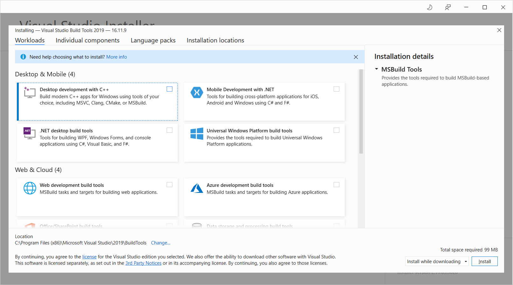
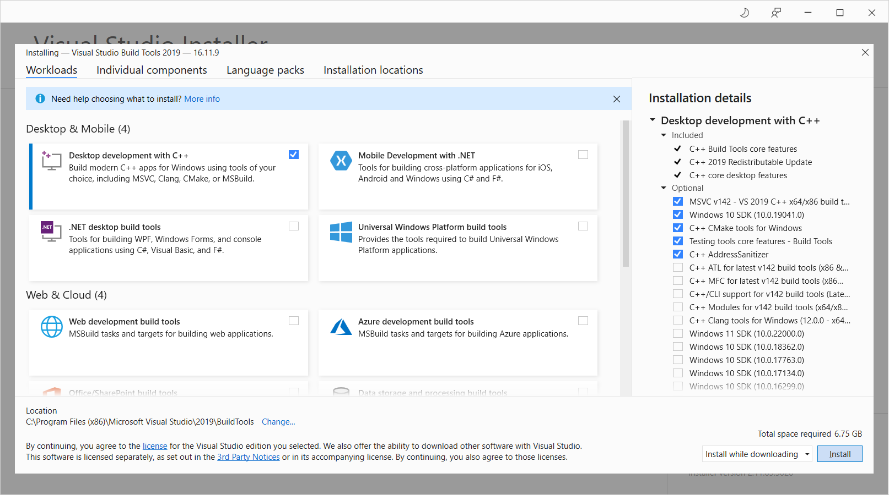
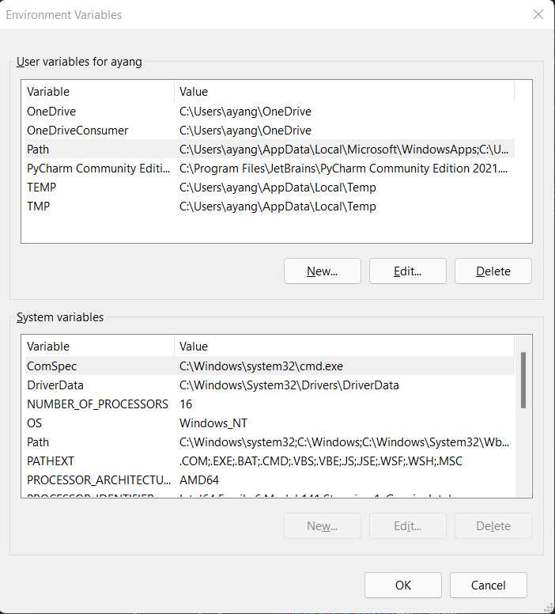
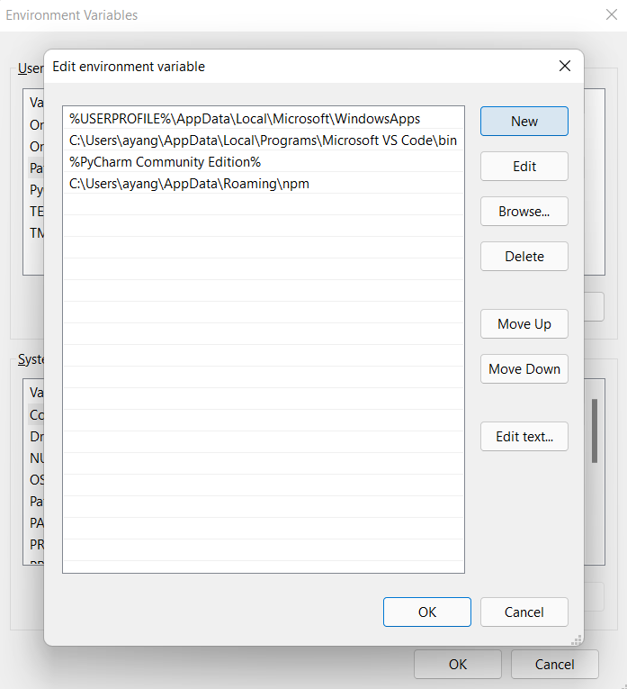
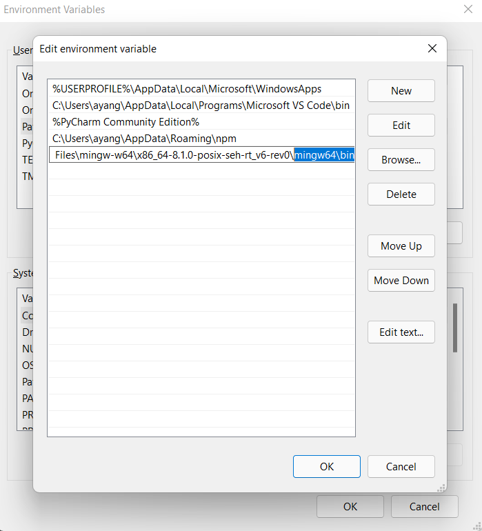

# Harmony

Harmony is a programming language designed for testing and experimenting with concurrent code.

- [Harmony](#harmony)
  - [Installing Python3](#installing-python3)
  - [Install Harmony via Pip](#install-harmony-via-pip)
  - [For Windows Users](#for-windows-users)
  - [Adding Scripts to PATH](#adding-scripts-to-path)
  - [Command-Line Harmony](#command-line-harmony)
  - [Harmony on VSCode](#harmony-on-vscode)
  - [Updating Harmony](#updating-harmony)
  - [Modifying your PATH variable](#modifying-your-path-variable)

For more information, please visit the official page https://harmony.cs.cornell.edu.

Harmony requires the following to be installed:

1. Python (version 3.6 or higher)
2. C compiler (potentially optional)

Note that in the following instructions, Windows users using WSL should follows instructions for Linux.

## Installing Python3

If you do not have Python3 already installed, download and install Python depending on
your OS (Windows, Mac, Linux, etc) on the official [Python site](https://www.python.org/downloads/).
Be sure to install Python version `3.6` or higher.

On the command line, you can check if Python has been successfully installed by running the following:

```sh
python --version
```

## Install Harmony via Pip

After installing `python`, you should also be able to use the command `pip`. Run the following command to get the latest version of Harmony:

```sh
pip install harmony-model-checker
```

## For Windows Users

For **Windows** users: you may encounter the error message along the lines of the following when installing `harmony-model-checker`:

```sh
error: Microsoft Visual C++ 14.0 or greater is required. Get it with
"Microsoft C++ Build Tools": https://visualstudio.microsoft.com/visual-cpp-build-tools/
```

This is to be expected if you had not installed the "Microsoft C++ Build Tools" before. Navigate to the outputted link and press `Download Build Tools` to download the installer. When you run the installer, you will encounter a selection screen such as the following:



Select `Desktop development with C++` in the `Desktop & Mobile` section and then install.



Note that this will likely take a while. When it finishes installing, run `pip install harmony-model-checker` again.

## Adding Scripts to PATH

When installing Harmony, you may encounter a warning on the command line of something like the following:

```sh
WARNING: The script harmony is installed in '</path/with/harmony/>' which is not on PATH.
  Consider adding this directory to PATH or, if you prefer to suppress this warning, use --no-warn-script-location.
```

If you do not see this warning, then you can continue.

Otherwise, add that path displayed in the message to your `PATH` variable. See [here](#modifying-your-path-variable) for extra information on editing the `PATH` variable.

## Command-Line Harmony

Once you have installed `harmony-model-checker`, you should be able to use the `harmony` command on your command line.

## Harmony on VSCode

Harmony is available as an extension on VSCode, which includes syntax highlighting and basic parser checks.

Please see [here](https://marketplace.visualstudio.com/items?itemName=kevinsun-dev-cornell.harmonylang) for a guide on the basic usage of the VSCode extension.

## Updating Harmony

Harmony can be updated by running the following `pip` command on the command line:

```sh
pip install --upgrade harmony-model-checker
```

## Modifying your PATH variable

**Windows**:

Search for **Edit environment variables** in the search bar. You can add it either to the `Path` associated with your account or the system `Path`.



Select the variable `Path` in the user variables section and then click "Edit", which opens a new pane.



Click "New" to add a new path, for example, the path to `gcc`.




**MacOS / Linux**:

Open the Terminal application. Check which shell is running on the Terminal. You check which one you have by running `echo "$SHELL"`.

The following instructions are for `bash` and `zsh`, where `/path/to/add` is to be substituted:

```sh
# for bash
echo "export PATH=$PATH:/path/to/add" >> ~/.bash_profile

# for zsh
echo "export PATH=$PATH:/path/to/add" >> ~/.zsh_profile
```
